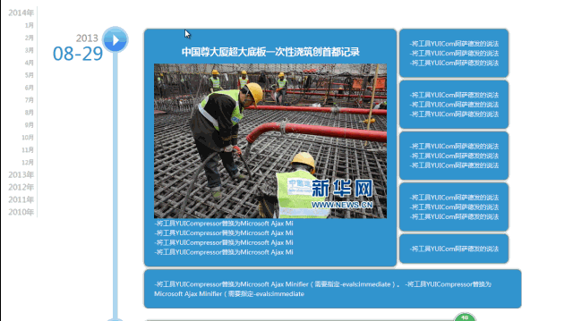
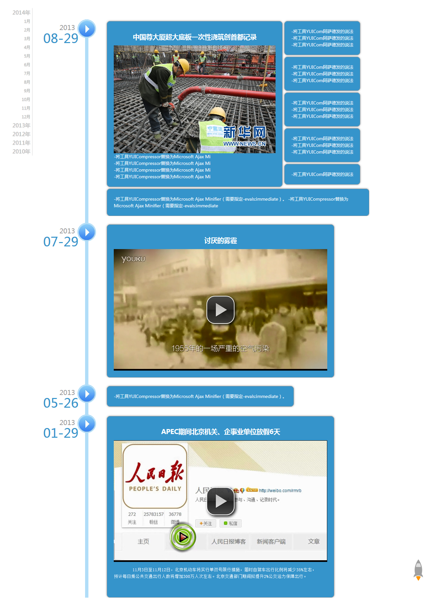

# TimeAxis

    系统中需要记录不同时间发生的事件，为了提升用户体验，时光轴是一个很好的展现方式。[据说这个东西挺火的，QQ空间和FB都在用...]
    
# Download
   https://github.com/CBDlkl/TimeAxis/releases
   
# 写在后面

    刚开始决定写时光轴的时候，在网上到处找jQuery插件，后来在三生石的博客里面看见了他写的文章，点醒了我，
    这种功能，完全可以自己纯手写的，动画并不复杂，而且网上的jQuery插件有的太臃肿。结果，一上午就写完了，
    事实证明，靠自己还是行的通的！
    
# 图示

    操作演示

    整体效果

